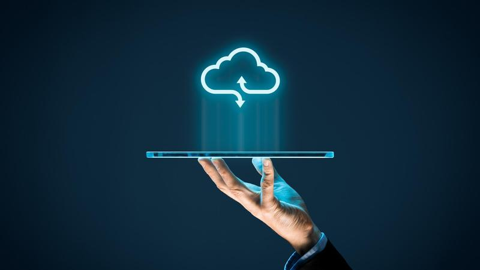
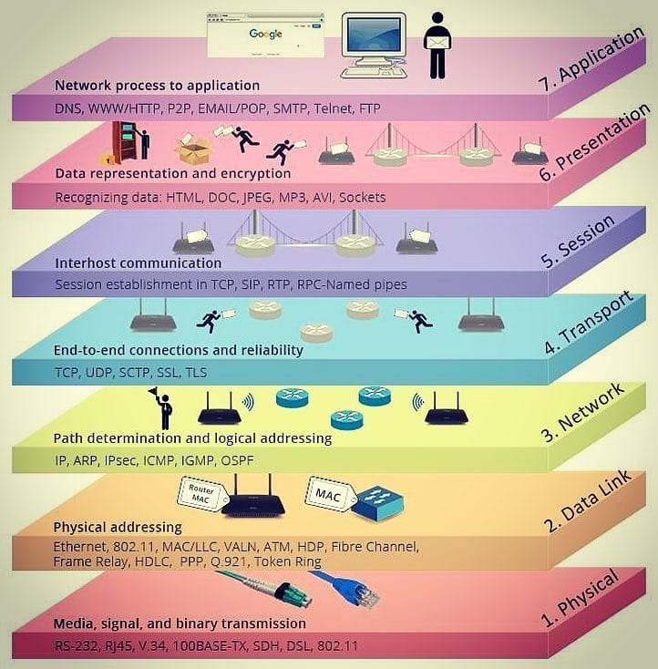

# Conceptos de la nube y Azure.

________

<h2></h2>

<h2 align="center">¿Qué es la nube?</h2>

El termino nube es una metáfora que hace referencia a la internet y describe una red global de servidores, cada uno con una función única. La nube te permite almacenar y acceder a datos y aplicaciones a través del Internet en lugar del disco duro de tu computadora. El sistema de almacenamiento en la nube no consiste en tener un hardware o servidor dedicado de almacenamiento conectado a la red en la residencia. Almacenar datos en una red domestica o de oficina es diferente a utilizar la nube. 

Cuando hablamos de la <strong>nube</strong> o <strong>cloud computing</strong> nos referimos al accedo de datos o programas por medio de la internet, o simplemente tenerlos sincronizados con otra información a través de la web.

  

 <h3>Tipos de nubes segun la propiedad</h3>
<ul>
 <strong><li>Nube publica</li></strong>
  
Una nube publica es una que puede usar cualquier persona y generalmente es ofrecida por una empresa externa, como Google, Amazon o Microsoft. Azure es una nube pública.

  <strong><li>Nube privada</li></strong>
  
La nube privada es una nube implementada por las mismas personas que la van a utilizar, tienen su propio equipo para uso personal.

  <strong><li>Nube hibrida</li></strong>
  
La nube privada es una nube implementada por las mismas personas que la van a utilizar, tienen su propio equipo para uso personal.

</ul>

 <h3>Tipos de nubes segun el servicio</h3>
<ul>
 <strong><li>SaaS</li></strong>
  
<strong>Software As A Service</strong> (software como servicio). En este tipo disponemos de la aplicacion o funcionalidad especifica lista para uso, no necesitas preparar el sistema o configurar la aplicacion, todo ya esta listo para su uso.

  <strong><li>PaaS</li></strong>
  
<strong>Platform As A Service</strong> (plataforma como servicio). Este tipo de nube el proveedor permite interactuar con unos servicios basicos ya preinstalados, esto nos da una mayor facilidad al instalar una aplicacion pues ya tenemos la base para comenzar nuestras operaciones lista.

  <strong><li>IaaS</li></strong>
  
<strong>Infrastructure As A Service</strong> (infraestrucutra como servicio). En este servicio tenemos un control absoluto sobre lo que pasa en el servidor y los recursos asigandos al mismo, podemos personalizarlo a nuestro gusto. Es el tipo de servicio que puedes utilizar si necesitas realizar operaciones muy especificas y requieren una personalizacion del ecosistema de software.

</ul>
 
 
-----------
<h2>Modelo OSI</h2>

 El modelo OSI o Open Systems Interconnection (Modelo de Interconexion de Sistemas Abiertos) es el modelo de referencia para los protocolos de red. Es una estandar con el objetivo de conseguir conectar sistemas de procedencia distinta para que estos pudieron intercambiar informacion sin ningun tipo de impedimientos debido a los protocolos con los que estos operaban inicialmente. 

 El modelo OSI consiste en 7 capas o niveles de abstraccion. Cada nivel posee sus propias funciones que en conjunto son capaces de lograr el objetivo final. 

<h3>Las 7 capas</h3>
<ul>
 <strong><li>Capa 1: Fisica</li></strong>
  
La primer capa del modelo OSI es la mas baja y esta se encarga de la topologia en la red y en las conexiones gloales hacia la red. En esta capa nos referimos al medio fisico que transmite la informacion. Los cables que rodean el mundo y sirven como un puente para transmitir la informacion por el mundo son un ejemplo de la capa fisica.

  <strong><li>Capa 2: Enlace de datos</li></strong>
  
La segunda capa se ocupa de los protocolos de comunicacion fisica, del accesso al medio, la deteccion de errores, la distribucion organizada de tramas y el control del flujo. Un ejemplo de esta capa son los router que transmiten el WI-FI.

 <strong><li>Capa 3: Red</li></strong>
  
La tercer capa esta encargada de identificar el enrutamiento existente entre una o mas redes. Determina el camino del punto A al punto B. La IP se encuentra en esta capa.

  <strong><li>Capa 4: De transporte</li></strong>
  
La capa de transporte esta encargada de llevar los datos de la maquina origen a la maquina destino, independientemente del tipo de red fisica que se este utilizando. Un ejemplo es el protocolo TCP o UDP. Netflix y varios servicios de streaming utilizan el protocolo UDP devido a que puede transmitir gran cantidad de datos por un periodo largo de tiempo.

  <strong><li>Capa 5: De sesion</li></strong>
  
Esta capa es la encargada mantener y controlar el enlace establecido entre dos dispositivos que esten transmitiendo informacion desde cualquier lado. Tambien se encarga de terminar la comunicacion o renaudarla en caso de un error inesperado. 

  <strong><li>Capa 6: De presentacion</li></strong>
  
El objetivo de esta capa es de la representacion de la informacion. Aunque ambos equipos posean distintas formas de representar los caracteres, los datos deben seguir llegando de manera reconocible. Ejemplos son los archivos .jpeg, .mp3 o HTML.

  <strong><li>Capa 7: Aplicacion</li></strong>
  
La capa de aplicacion es el resultado de todas las demas y lo que observa el usuario, distintas aplicaciones con las que el usuario puede interactuar; una pagina web, el correo electronico,  gestores de bases de datos, servidores de ficheros, etc. Pero si cabe aclarar que el usuario no interactua directamente con este nivel, los programas son los que en realidad interactuan con las demas capas y ocultan la complejidad de la comunicacion o interaccion.

</ul>

  

 

